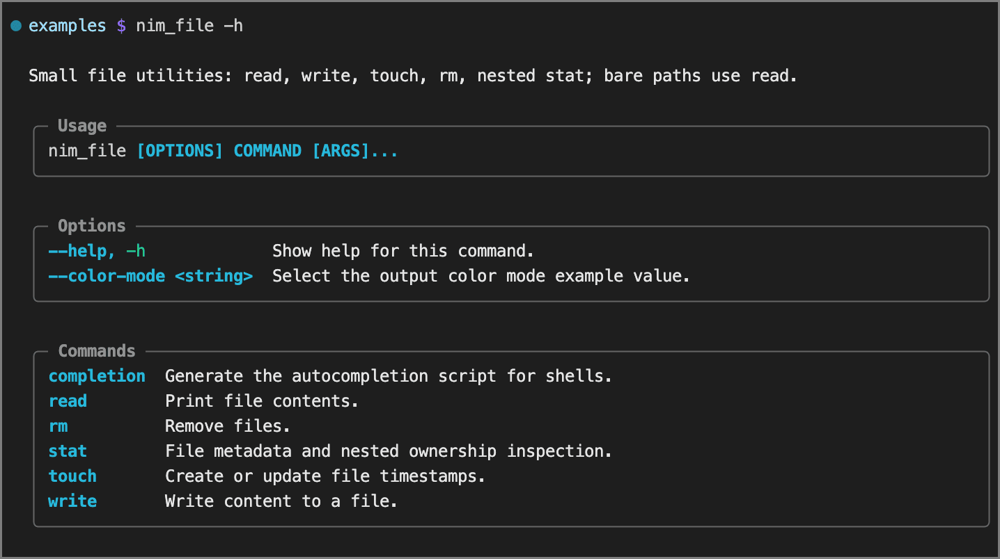
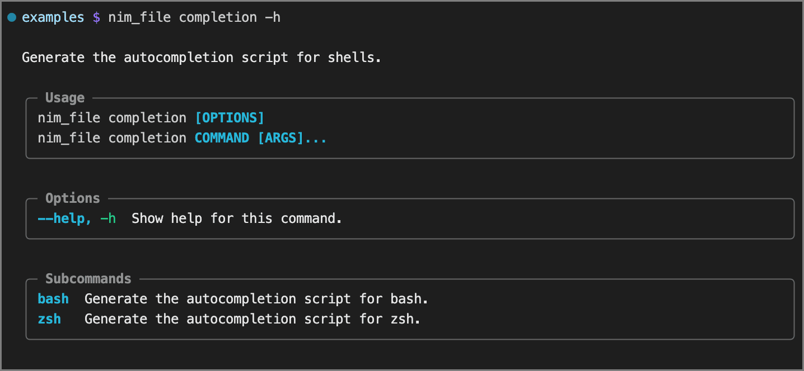
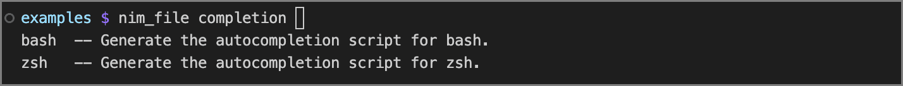

<!-- Big money NE - https://patorjk.com/software/taag/#p=testall&f=Bulbhead&t=shebangsy&x=none&v=4&h=4&w=80&we=false> -->

# argsbarg

[](https://github.com/bdombro/nim-argsbarg)

[](LICENSE)
[](https://nim-lang.org/)
[-lightgrey)](#)

Build beautiful, well-behaved CLI apps in Nim — no third-party runtime dependencies, just add the ArgsBarg package.

Describe your CLI as plain Nim objects. `argsbarg` handles parsing, validation, scoped help, ANSI styling, and shell tab completion.

**ArgsBarg** is *schema-first* -- define your entire CLI’s structure, commands, options, and help in a single, explicit data model, making the command-line interface centralized, clear and self-describing upfront. `nim-argsbarg` has siblings --> [cpp](https://github.com/bdombro/cpp-argsbarg), and [swift](https://github.com/bdombro/swift-argsbarg).

Halps! -->


Sub-level Halps! -->


Shell completions! -->



## Quick start

```bash
nimble install argsbarg
```

```nim
import std/[os, options]
import argsbarg

proc greet(ctx: CliContext) =
  let who = ctx.optString("name").get("world")
  echo styleGreen("hello"), " ", who

when isMainModule:
  cliRun(
    CliSchema(
      commands: @[
        cliLeaf(
          "hello",
          "Say hello.",
          greet,
          options = @[
            cliOptString("name", "Who to greet.", 'n'),
            cliOptFlag("verbose", "Enable extra logging.", 'v'),
          ],
        ),
      ],
      description: "Tiny demo.",
      name: "helloapp",
    ),
    commandLineParams(),
  )
```

Every app gets two built-ins injected by `cliRun` for free:

- `-h` / `--help` at any routing depth, scoped to the current node.
- `completion zsh` / `completion bash` — print an installable shell completion script.

`completion` is reserved. Don't reuse it as a top-level command name.


## How it works

- **Define a schema** with `CliSchema`, `cliLeaf` / `cliGroup`, and `cliOpt*` / `cliArg*` helpers.
  On Nim 2+, empty seqs default to `@[]`, so you only write the interesting parts.
- **Call `cliRun(schema, argv)`** — validates the schema, parses argv, renders help or errors,
  wires built-ins, and dispatches the right leaf handler.
- **`cliErrWithHelp(ctx.schema, ctx.command, msg)`** — from a handler, print a red error and the
  same contextual help stderr block parse/validation errors use, then exit 1.
- **Call `cliParse(schema, argv)`** for a raw `CliParseResult` (useful in tests). Pass a merged
  schema via `cliMergeBuiltins` to include the built-ins.

**Exit codes (`cliRun`):** `0` — handler finished, or explicit `-h` / `--help`. `1` — parse or
validation error, implicit help (empty argv or stopped on a routing node without a subcommand),
or `cliErrWithHelp`.

**Help text:** boxed sections use visible width (ANSI stripped). Description wrapping uses UTF-8 byte
length, so it matches typical ASCII help; unusual wide or combining characters may diverge slightly
from the box edges.

### Commands: leaves vs. routing nodes

A **leaf** is built with `cliLeaf` and must include a `CliHandler`. No child subcommands.

A **routing node** is built with `cliGroup` and requires a non-empty `commands` sequence.
argsbarg prints contextual help if argv stops on a routing node without picking a subcommand.

### Options and positionals

Long options: `--name`, `--name value`, or `--name=value`.

Short aliases: pass a `char` to `cliOptFlag` / `cliOptString` / `cliOptNumber`. Valued shorts
use `-n value`; boolean shorts can be bundled (`-abc` sets all three when every flag is
presence-only).

Positionals are attached to leaf commands via `arguments`:

```nim
cliLeaf(
  "greet", "Greet people.", handler,
  arguments = @[
    cliArg("name", "Name to greet."),              # required single: <name>
    cliArg("title", "Title.", optional = true),    # optional single: [title]
    cliArgList("files", "Files to process."),      # zero or more:   [files...]
    cliArgList("inputs", "Inputs.", min = 1),      # one or more:    <inputs...>
    cliArgList("items", "Items.", min = 1, max = 3), # one to three: <items...>
  ],
)
```

- `cliArg` — one slot; required by default, optional via `optional = true`.
- `cliArgList` — tail slot; `min` defaults `0`, `max` defaults `0` (unlimited). Only the last
  positional on a command may have `max = 0`.

### Reading values in a handler

```nim
ctx.optFlag("verbose")   # bool  — was the flag passed?
ctx.optNumber("count")   # Option[float]
ctx.optString("name")    # Option[string]
ctx.args                 # seq[string] — positionals in declaration order
```


### Root command fallback (`fallbackCommand` / `fallbackMode`)

Many CLIs have one main job (`compress`, `run`, `read`, …) that users invoke directly without
spelling the subcommand name. Root fallback replaces the usual argv preprocessor pattern.

Two optional fields on `CliSchema`:

- **`fallbackCommand`**: `some("name")` — must match a direct child of `commands`.
- **`fallbackMode`**: when the fallback applies. Three choices:

The examples below assume a toy app with top-level commands `compress`, `list`, and
`fallbackCommand: some("compress")`.

#### `cliFallbackWhenMissing` (default)

Fallback only when no command token remains after root flags.

```bash
mytool                    # → compress (empty argv)
mytool compress doc.pdf   # → compress
mytool list               # → list
mytool -q 2 doc.pdf       # → error: -q unknown at root (unless declared as root option)
```

Use when `mytool` alone should run the main subcommand and you want unknown first words to fail.

#### `cliFallbackWhenMissingOrUnknown`

Same as above, plus: an unrecognized first token is treated as if `compress` were written first.
Declared root options are consumed first. Real command names (including `completion`) still win.

```bash
mytool                    # → compress
mytool doc.pdf            # → compress (bare path routed to compress)
mytool -q 2 doc.pdf       # → compress with -q and doc.pdf
mytool list               # → list
```

Use for verb-optional single-action tools.

#### `cliFallbackWhenUnknown`

Like `cliFallbackWhenMissingOrUnknown` for the non-empty case, but empty argv always shows
root help.

```bash
mytool                    # → root help
mytool doc.pdf            # → compress on doc.pdf
mytool -q 2 doc.pdf       # → compress with flags and file
mytool list               # → list
```

Use when the app has several top-level commands but one path-shaped default (e.g. `nim_file`,
`nimr`, `gor`).


## Examples

### `examples/nim_minimal.nim`

One command, one option.

```bash
nim c -p:src examples/nim_minimal.nim
./examples/nim_minimal hello --name world
./examples/nim_minimal hello -n world
./examples/nim_minimal --name world
./examples/nim_minimal -h
./examples/nim_minimal completion zsh
```

### `examples/nim_file.nim`

Nested subcommands (`stat → owner → lookup`), options at multiple routing levels, positional
arguments, and `cliFallbackWhenUnknown` so bare paths route to `read`.

```bash
nim c -p:src examples/nim_file.nim

./examples/nim_file                                              # overview help
./examples/nim_file ./README.md                                  # → read (bare path)
./examples/nim_file stat -h
./examples/nim_file stat owner lookup --user-name alice ./README.md
./examples/nim_file rm a.txt b.txt
./examples/nim_file read ./README.md
./examples/nim_file write ./out.txt --content hello
./examples/nim_file completion zsh
```


## Schema reference

All schema types are plain Nim `object` values on Nim 2+. Required fields must be set
explicitly; fields with defaults can be omitted.

### `cliGroup`

Builds a routing node. `commands` is required; `handler` is always unset.

| Parameter | Notes |
| --- | --- |
| `name` / `description` | CLI token and help text. |
| `commands` | **Required.** Child commands (`cliLeaf` or `cliGroup`). |
| `options` | Flags scoped to this node. |
| `notes` | Default: `""`. Extra prose for `cmd -h` on this node; shown in a **Notes** box. Use `{app}` for `CliSchema.name`. |

### `cliLeaf`

Builds a leaf. `handler` is required at compile time (not an `Option`).

| Parameter | Notes |
| --- | --- |
| `name` / `description` | Command token and help blurb. |
| `handler` | **Required.** Named `{.nimcall.}` proc. |
| `arguments` | Positional slots (`cliArg` / `cliArgList`). |
| `options` | Flags scoped to this leaf. |
| `notes` | Default: `""`. Extra prose for `cmd -h` on this leaf; shown in a **Notes** box. Use `{app}` for `CliSchema.name`. |

### `CliCommand`

Prefer `cliLeaf` / `cliGroup`; construct `CliCommand(...)` directly when you need full control.

| Field | Type | Default | Notes |
| --- | --- | --- | --- |
| `arguments` | `seq[CliOption]` | `@[]` | Positional slots. Use `cliArg` / `cliArgList`. |
| `commands` | `seq[CliCommand]` | `@[]` | Non-empty → routing node. |
| `description` | `string` | Required | Help blurb. |
| `handler` | `Option[CliHandler]` | Required | `some(proc)` for leaf; `none` for routing node. |
| `name` | `string` | Required | Token users type. |
| `notes` | `string` | `""` | Long-form help for `-h` on this node; **Notes** box. `{app}` → schema name. |
| `options` | `seq[CliOption]` | `@[]` | Flags scoped to this command. |

### `CliContext`

What your handler receives.

| Field | Type | Notes |
| --- | --- | --- |
| `appName` | `string` | Same as `CliSchema.name`. |
| `args` | `seq[string]` | Positionals collected in order. |
| `command` | `seq[string]` | Full command path, e.g. `@["stat", "owner", "lookup"]`. |
| `opts` | `Table[string, string]` | Flags keyed by long name. Presence flags store `"1"`. |
| `schema` | `CliSchema` | Merged schema (builtins included). Pass to `cliErrWithHelp` with `command`. |

Prefer `optFlag`, `optNumber`, `optString` over reading `opts` directly.

### `CliHandler`

```nim
type CliHandler* = proc (ctx: CliContext) {.nimcall.}
```

### `CliOption`

Covers both `--flags` and positional slots. `isPositional` is the switch.
Prefer the `cliOpt*` / `cliArg*` helpers over constructing `CliOption(...)` by hand.

| Field | Type | Default | Notes |
| --- | --- | --- | --- |
| `argMax` | `int` | `1` | Positionals only: max argv words (`0` = unlimited). |
| `argMin` | `int` | `1` | Positionals only: min argv words required. |
| `description` | `string` | Required | Help text. |
| `isPositional` | `bool` | `false` | `true` → positional slot, not a flag. |
| `kind` | `CliValueKind` | Required | See `CliValueKind`. |
| `name` | `string` | Required | Flag stem (no `--`) or positional label. |
| `shortName` | `char` | `'\0'` | `-v` style alias. Reserved: `h`. Positionals reject short names. |

### Flag builders

| Builder | Kind | Description |
| --- | --- | --- |
| `cliOptFlag(name, desc, short?)` | `cliValueNone` | Presence flag; supports short bundling. |
| `cliOptNumber(name, desc, short?)` | `cliValueNumber` | Float-valued flag. |
| `cliOptString(name, desc, short?)` | `cliValueString` | String-valued flag. |

### Positional builders

| Builder | Help text | Notes |
| --- | --- | --- |
| `cliArg(name, desc)` | `<name>` | Required single word. |
| `cliArg(name, desc, optional=true)` | `[name]` | Optional single word. |
| `cliArgList(name, desc)` | `[name...]` | Zero or more words. |
| `cliArgList(name, desc, min=1)` | `<name...>` | One or more words. |
| `cliArgList(name, desc, min=1, max=3)` | `<name...>` | One to three words. |

Validation rules: `argMin <= argMax` when `argMax > 0`; only the last positional may have
`argMax = 0`; optional positionals (`argMin = 0`) may not precede required ones.

### `CliFallbackMode`

| Value | Empty argv | Unknown first token |
| --- | --- | --- |
| `cliFallbackWhenMissing` | → fallback | → error |
| `cliFallbackWhenMissingOrUnknown` | → fallback | → fallback |
| `cliFallbackWhenUnknown` | → root help | → fallback |

### `CliSchema`

| Field | Type | Default | Notes |
| --- | --- | --- | --- |
| `commands` | `seq[CliCommand]` | Required | Top-level commands. `completion` is reserved. |
| `description` | `string` | Required | One-liner in root help. |
| `fallbackCommand` | `Option[string]` | `none` | Must match a child of `commands`. |
| `fallbackMode` | `CliFallbackMode` | `cliFallbackWhenMissing` | When the fallback fires. |
| `name` | `string` | Required | App name; also used for completion script filename. |
| `options` | `seq[CliOption]` | `@[]` | Root-level flags, parsed before the first command token. |

### `CliValueKind`

| Value | Meaning |
| --- | --- |
| `cliValueNone` | Presence flag; stores `"1"` in `ctx.opts`; supports short bundling. |
| `cliValueNumber` | Float-valued; validated after parsing. |
| `cliValueString` | String-valued. |


## Shell completions

**Zsh:** `<app> completion zsh` **prints** the completion script to stdout only (same as bash).
Redirect stdout to `~/.zsh/completions/_{appname}` and add that directory to `fpath` before
`compinit` if you use the `fpath` layout.

**Bash:** `<app> completion bash` **prints** the script to stdout only. Redirect to a file and
`source` it from `~/.bashrc` or drop it under `bash_completion.d`. `bash -n` on the output should pass
cleanly.

Both generators cover commands, subcommands, long options, and short aliases. Leaf commands
with positional arguments get file-path completion (`_files` / `compgen -f`).


## Dev

```bash
just build          # compile library + examples
just test           # run tests/
just smoke-file     # focused CLI checks for nim_file
just smoke-minimal  # focused checks for nim_minimal
just release-check  # full build + tests + completion syntax check
just release patch    # SemVer bump, CHANGELOG, release-check, git tag/push, gh release (see scripts/release.py)
```

`just release` needs `gh` (GitHub CLI) installed and `gh auth login` so the script can open a GitHub
Release whose body is the new version section in `CHANGELOG.md`.

To compile examples directly against the working tree:

```bash
nim c -p:src examples/nim_file.nim
nim c -p:src examples/nim_minimal.nim
```

`nimble test` works, but Nimble needs at least one Git commit to resolve a VCS revision. Use
`just test` or make an initial commit if Nimble complains.


## License

MIT. See `LICENSE`.
